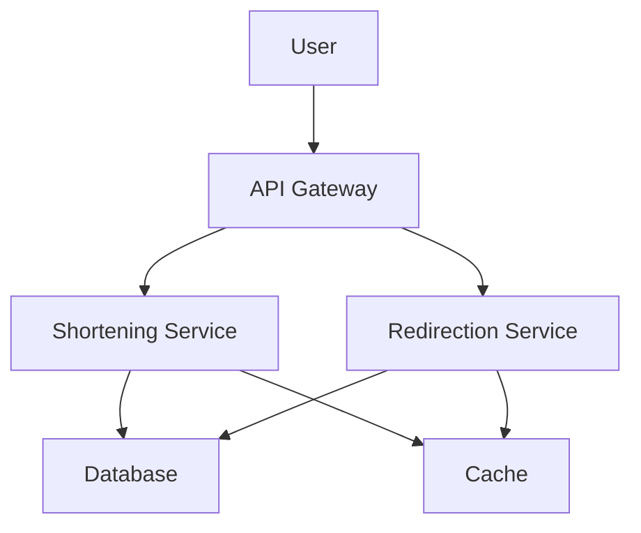
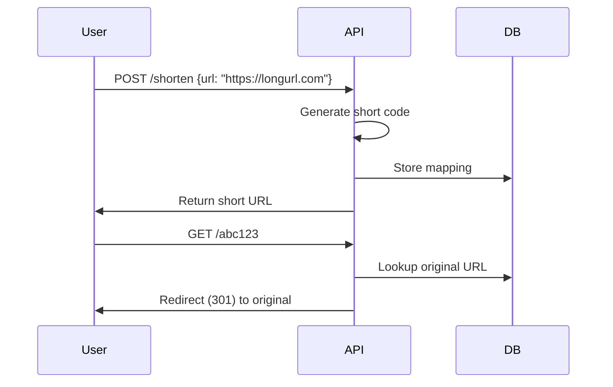

# Overview

A URL shortener service, like bit.ly or TinyURL, converts long URLs into short, shareable links. It involves generating unique short codes, storing URL mappings, and handling redirections at scale.

# Detailed Explanation

## Requirements

- Functional: Shorten URLs, redirect to original
- Non-functional: High availability, low latency, scalability

## High-Level Design (HLD)

- API Gateway for requests
- Shortening service
- Database for storage
- Cache for fast lookups
- Load balancer



## Low-Level Design (LLD)

- Short code generation: Base62 encoding of counter or hash
- Database schema: table with short_code, long_url, created_at, expires_at
- Caching: Redis for hot URLs

# Journey / Sequence



# Real-world Examples & Use Cases

- Social media sharing
- Marketing campaigns
- Analytics tracking

# Code Examples

## Java Implementation (Simple)

```java
import java.util.HashMap;
import java.util.Map;

public class URLShortener {
    private Map<String, String> urlMap = new HashMap<>();
    private int counter = 0;

    public String shorten(String longUrl) {
        String shortCode = generateShortCode();
        urlMap.put(shortCode, longUrl);
        return "http://short.ly/" + shortCode;
    }

    public String redirect(String shortCode) {
        return urlMap.get(shortCode);
    }

    private String generateShortCode() {
        return Integer.toString(counter++, 36); // base36
    }
}
```

## Python with Flask

```python
from flask import Flask, redirect, request
import hashlib

app = Flask(__name__)
url_store = {}

@app.route('/shorten', methods=['POST'])
def shorten():
    long_url = request.form['url']
    short_code = hashlib.md5(long_url.encode()).hexdigest()[:6]
    url_store[short_code] = long_url
    return f"http://short.ly/{short_code}"

@app.route('/<short_code>')
def redirect(short_code):
    if short_code in url_store:
        return redirect(url_store[short_code])
    return "Not found", 404
```

# Data Models / Message Formats

```json
{
  "shortUrl": "http://short.ly/abc123",
  "longUrl": "https://example.com/very/long/path",
  "createdAt": "2023-09-25T00:00:00Z",
  "clicks": 42
}
```

# Common Pitfalls & Edge Cases

- Collisions: Handle hash collisions.
- Expiration: Implement TTL for URLs.
- Analytics: Track clicks without slowing redirects.

# Tools & Libraries

- Databases: PostgreSQL, Cassandra.
- Caching: Redis.
- Frameworks: Spring Boot for API.

# References

- [System Design: URL Shortening Service](https://www.geeksforgeeks.org/system-design-url-shortening-service/)
- [Designing a URL Shortening service like TinyURL](https://medium.com/@sandeep4.verma/designing-a-url-shortening-service-like-tinyurl-73a04d986e8f)
- [System Design Primer: URL Shortener](https://github.com/donnemartin/system-design-primer#url-shortener)
- [Bitly Architecture](https://bitly.com/blog/)

# Github-README Links & Related Topics

- [Caching](../caching/README.md)
- [Database Sharding Strategies](../database-sharding-strategies/README.md)
- [Load Balancing and Strategies](../load-balancing-and-strategies/README.md)