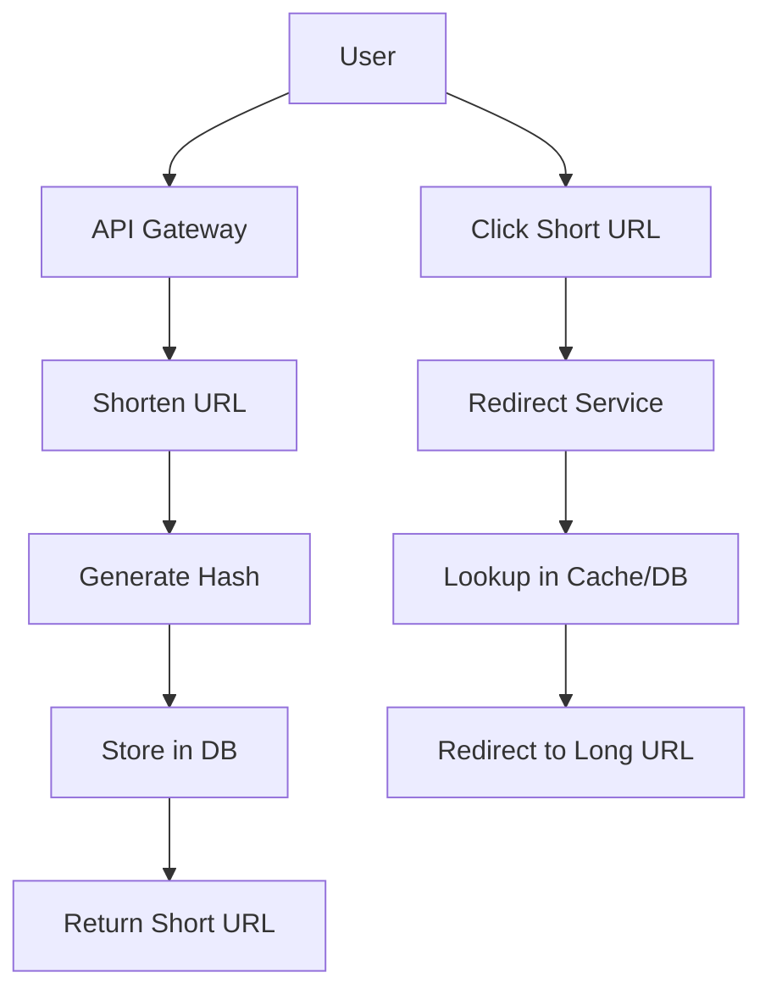

## Overview

A URL shortener service converts long URLs into short, shareable links. It must handle high traffic, ensure uniqueness, and provide fast redirects while maintaining data integrity.

## Detailed Explanation

## Components
- **API Layer**: REST endpoints for shortening and redirecting.
- **Database**: Store URL mappings, use hash for short codes.
- **Caching**: Redis for fast lookups.
- **Load Balancer**: Distribute traffic.

## Key Algorithms
- **Hashing**: MD5 or Base62 encoding for short URLs.
- **Collision Handling**: Retry with salt if collision.

## Scalability
- **Sharding**: Distribute data across DB shards.
- **CDN**: For global redirects.


## Real-world Examples & Use Cases

- **Social Media**: Share links on Twitter.
- **Marketing**: Track click analytics.
- **Internal Tools**: Shorten long internal URLs.

## Code Examples

```java
// Simple hash-based shortener
import java.security.MessageDigest;
import java.math.BigInteger;

public class URLShortener {
    public String shorten(String url) {
        try {
            MessageDigest md = MessageDigest.getInstance("MD5");
            byte[] hash = md.digest(url.getBytes());
            return new BigInteger(1, hash).toString(16).substring(0, 7);
        } catch (Exception e) {
            return null;
        }
    }
}
```

## Data Models / Message Formats

```json
{
  "shortUrl": "http://short.ly/abc123",
  "longUrl": "https://example.com/very/long/path",
  "createdAt": "2023-09-25T00:00:00Z",
  "clicks": 42
}
```

## Common Pitfalls & Edge Cases
- **Collisions**: Handle hash collisions.
- **Expiration**: Implement TTL for URLs.
- **Analytics**: Track clicks without slowing redirects.
## Tools & Libraries

- **Databases**: PostgreSQL, Cassandra.
- **Caching**: Redis.
- **Frameworks**: Spring Boot for API.

## References
- [System Design Primer: URL Shortener](https://github.com/donnemartin/system-design-primer#url-shortener)
- [Bitly Architecture](https://bitly.com/blog/)
## Github-README Links & Related Topics

- [System Design Basics](../system-design-basics/README.md)
- [Caching](../caching/README.md)
- [Database Sharding Strategies](../database-sharding-strategies/README.md)