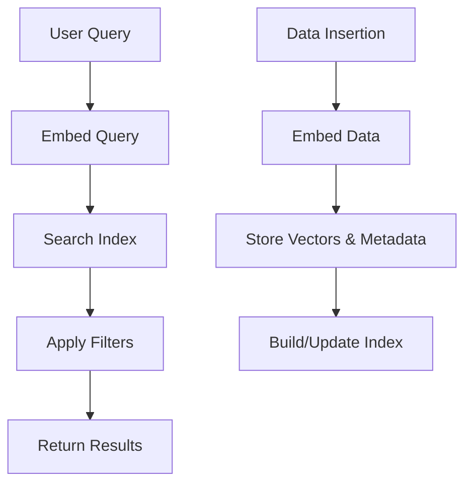

# Vector Databases

## Overview

Vector databases are specialized databases designed to store, index, and query high-dimensional vector embeddings alongside associated metadata. Unlike traditional relational databases optimized for structured data, vector databases excel at handling unstructured data (e.g., text, images, audio) by representing it as numerical vectors in a high-dimensional space. They enable efficient similarity search using approximate nearest neighbor (ANN) algorithms, allowing retrieval of semantically similar items at scale.

Key features include:
- **Vector Storage and Indexing**: Efficient storage of embeddings with optimized indexing for fast retrieval.
- **Similarity Search**: Query for vectors closest to a given query vector using metrics like cosine similarity or Euclidean distance.
- **Metadata Filtering**: Combine vector search with scalar filters for refined results.
- **Scalability**: Support for distributed architectures, horizontal scaling, and serverless deployments.
- **CRUD Operations**: Full database functionality including create, read, update, delete for vectors and metadata.

Vector databases are foundational for AI applications, powering retrieval-augmented generation (RAG), recommendation systems, and semantic search.

## Detailed Explanation

### Vector Embeddings

Vector embeddings are numerical representations of data in a high-dimensional vector space (typically 100-1000+ dimensions). They capture semantic meaning, where similar items cluster together. For example, words like "cat" and "kitten" are closer in vector space than "cat" and "car".

Embeddings are generated using machine learning models (e.g., transformers like BERT or CLIP):
- **Text Embeddings**: Convert sentences or documents into vectors (e.g., via Sentence-BERT).
- **Image Embeddings**: Extract features from images (e.g., via ResNet or CLIP).
- **Audio/Video Embeddings**: Represent waveforms or frames numerically.

The same embedding model must be used for queries and stored data to ensure compatibility.

### Vector Search and Similarity Measures

Vector search finds the most similar vectors to a query vector using distance metrics:
- **Cosine Similarity**: Measures angle between vectors; range [-1, 1], higher values indicate similarity.
- **Euclidean Distance (L2)**: Straight-line distance; range [0, ∞], lower values indicate similarity.
- **Dot Product**: Product of magnitudes and cosine; range [-∞, ∞], higher values indicate similarity.
- **Manhattan Distance (L1)**: Sum of absolute differences; range [0, ∞], lower values indicate similarity.
- **Hamming Distance**: For binary vectors, counts differing bits.

Exact search (brute-force) is O(n), impractical for large datasets. ANN algorithms approximate results efficiently.

### Vector Indexing Algorithms

Indexing organizes vectors for fast ANN search, trading accuracy for speed. Common algorithms:
- **HNSW (Hierarchical Navigable Small World)**: Graph-based, builds layered graphs for navigation. Fast and accurate, default in many databases.
- **IVF (Inverted File)**: Clusters vectors, searches within relevant clusters. Variants like IVF-PQ combine with quantization.
- **PQ (Product Quantization)**: Compresses vectors by splitting into sub-vectors and quantizing. Reduces memory usage.
- **LSH (Locality-Sensitive Hashing)**: Hashes similar vectors to the same buckets. Probabilistic, good for high dimensions.
- **DiskANN**: Disk-based for massive datasets, uses SSDs for scalability.

Indexing is compute-intensive but enables sub-millisecond queries.

### Architecture and Operations

Vector databases decouple storage and compute for scalability. A typical architecture includes:
- **Query Nodes**: Handle search requests.
- **Data Nodes**: Manage insertions and indexing.
- **Index Nodes**: Build and maintain indexes.
- **Metadata Store**: Stores scalar data and filters (e.g., via etcd or similar).

Operations:
- **Insertion**: Embed data, store vectors and metadata.
- **Querying**: Embed query, search index, apply filters, return top-k results.
- **Updates/Deletes**: Modify vectors or metadata, rebuild indexes as needed.
- **Backup/Recovery**: Snapshot collections for disaster recovery.

Serverless variants (e.g., Pinecone) separate storage from compute, optimizing costs by scaling compute dynamically.



### Filtering and Hybrid Search

Metadata filtering refines searches (e.g., "find similar images tagged as 'cats'"). Pre-filtering applies filters before search; post-filtering after. Hybrid search combines vector and keyword search (e.g., BM25 for text).

## Real-world Examples & Use Cases

Vector databases power diverse applications:

1. **Retrieval-Augmented Generation (RAG)**: Enhance LLMs by retrieving relevant documents. E.g., ChatGPT with external knowledge bases.
2. **Recommendation Systems**: Suggest products/movies based on user preferences. E.g., Netflix uses embeddings for personalized recommendations.
3. **Semantic Search**: Find relevant content via meaning, not keywords. E.g., e-commerce search for "red dress" finds visually similar items.
4. **Image/Video Similarity**: Reverse image search or duplicate detection. E.g., Google Images or content moderation.
5. **Fraud Detection**: Identify anomalous transactions by comparing embeddings of user behavior.
6. **Drug Discovery**: Search molecular embeddings for similar compounds.
7. **Chatbots and QA Systems**: Retrieve context for accurate responses.

Example: In e-commerce, a user searches "wireless headphones." Embeddings find products with similar features, even if descriptions differ.

## Code Examples

### Using Pinecone (Python)

Install: `pip install pinecone-client`

```python
import pinecone
from sentence_transformers import SentenceTransformer

# Initialize Pinecone
pinecone.init(api_key="your-api-key", environment="us-west1-gcp")
index = pinecone.Index("example-index")

# Load embedding model
model = SentenceTransformer('all-MiniLM-L6-v2')

# Insert data
texts = ["Vector databases are powerful.", "Embeddings capture semantics."]
vectors = model.encode(texts).tolist()
index.upsert(vectors=[(str(i), vec, {"text": text}) for i, (vec, text) in enumerate(zip(vectors, texts))])

# Query
query = "What are embeddings?"
query_vec = model.encode([query]).tolist()[0]
results = index.query(vector=query_vec, top_k=2, include_metadata=True)
print(results)
```

### Using Milvus (Python)

Install: `pip install pymilvus`

```python
from pymilvus import connections, Collection, DataType, FieldSchema, CollectionSchema
import numpy as np

# Connect to Milvus
connections.connect("default", host="localhost", port="19530")

# Define schema
fields = [
    FieldSchema(name="id", dtype=DataType.INT64, is_primary=True, auto_id=True),
    FieldSchema(name="vector", dtype=DataType.FLOAT_VECTOR, dim=384)
]
schema = CollectionSchema(fields, "example_collection")
collection = Collection("example_collection", schema)

# Insert vectors
vectors = np.random.random((100, 384)).tolist()
collection.insert([vectors])

# Build index
index_params = {"metric_type": "COSINE", "index_type": "HNSW", "params": {"M": 16, "efConstruction": 256}}
collection.create_index("vector", index_params)

# Query
query_vec = np.random.random(384).tolist()
collection.load()
results = collection.search([query_vec], "vector", {"metric_type": "COSINE"}, limit=5)
print(results)
```

### Using Weaviate (Python)

Install: `pip install weaviate-client`

```python
import weaviate
from sentence_transformers import SentenceTransformer

# Connect to Weaviate
client = weaviate.Client("http://localhost:8080")

# Load model
model = SentenceTransformer('all-MiniLM-L6-v2')

# Create class
class_obj = {
    "class": "Document",
    "vectorizer": "none",  # Manual embeddings
    "properties": [
        {"name": "text", "dataType": ["string"]},
    ]
}
client.schema.create_class(class_obj)

# Insert data
texts = ["Vector databases explained.", "Embeddings in AI."]
vectors = model.encode(texts).tolist()
client.batch.configure(batch_size=10)
with client.batch as batch:
    for text, vec in zip(texts, vectors):
        batch.add_data_object({"text": text}, "Document", vector=vec)

# Query
query = "Explain vectors."
query_vec = model.encode([query]).tolist()[0]
result = client.query.get("Document", ["text"]).with_near_vector({"vector": query_vec}).with_limit(2).do()
print(result)
```

## Tools & Libraries

| Tool/Library | License | Key Features | Use Case |
|--------------|---------|--------------|----------|
| [Milvus](https://github.com/milvus-io/milvus) | Apache 2.0 | Distributed, GPU acceleration, multiple indexes | Large-scale production |
| [Weaviate](https://github.com/weaviate/weaviate) | BSD 3-Clause | GraphQL API, hybrid search, plugins | Knowledge graphs, RAG |
| [Pinecone](https://www.pinecone.io/) | Proprietary (Managed) | Serverless, metadata filtering, namespaces | Cloud-native AI apps |
| [Chroma](https://github.com/chroma-core/chroma) | Apache 2.0 | Lightweight, Python-native | Prototyping, small-scale |
| [Qdrant](https://github.com/qdrant/qdrant) | Apache 2.0 | REST API, payload filtering, clustering | Real-time search |
| [Faiss](https://github.com/facebookresearch/faiss) | MIT | Library for ANN search | Research, custom integrations |

## Common Pitfalls & Edge Cases

- **Wrong Similarity Metric**: Mismatched metrics (e.g., cosine vs. Euclidean) lead to poor results. Always match the embedding model's metric.
- **Indexing Overhead**: Rebuilding indexes on updates can be slow; use incremental updates where possible.
- **Dimensionality Curse**: High dimensions increase computation; consider dimensionality reduction (e.g., PCA).
- **Cold Starts**: In serverless setups, initial queries may be slow due to compute spin-up.
- **Metadata Filtering**: Pre-filtering reduces recall; balance with post-filtering.
- **Scalability Limits**: For billions of vectors, ensure distributed setup; monitor shard distribution.
- **Edge Case: Sparse Data**: Use sparse vectors for text with BM25; dense vectors fail on zero-heavy embeddings.

## References

- [Vector database - Wikipedia](https://en.wikipedia.org/wiki/Vector_database)
- [What is a Vector Database & How Does it Work? - Pinecone](https://www.pinecone.io/learn/vector-database/)
- [A Gentle Introduction to Vector Databases - Weaviate](https://weaviate.io/blog/what-is-a-vector-database)
- [What is Milvus - Milvus Docs](https://milvus.io/docs/overview.md)
- [Vector Embeddings Explained - Pinecone](https://www.pinecone.io/learn/vector-embeddings/)
- [Vector Search Explained - Weaviate](https://weaviate.io/blog/vector-search-explained)

## Github-README Links & Related Topics

- [Milvus Repository](https://github.com/milvus-io/milvus)
- [Weaviate Repository](https://github.com/weaviate/weaviate)
- [Pinecone Docs](https://docs.pinecone.io/)
- [Chroma Repository](https://github.com/chroma-core/chroma)
- [Qdrant Repository](https://github.com/qdrant/qdrant)

Related Topics:
- [Machine Learning in System Design](../machine-learning-in-system-design/README.md)
- [Retrieval-Augmented Generation (RAG)](../retrieval-augmented-generation/README.md)
- [Embeddings and Vectorization](../embeddings-and-vectorization/README.md)
- [Scalable Data Storage](../scalable-data-storage/README.md)