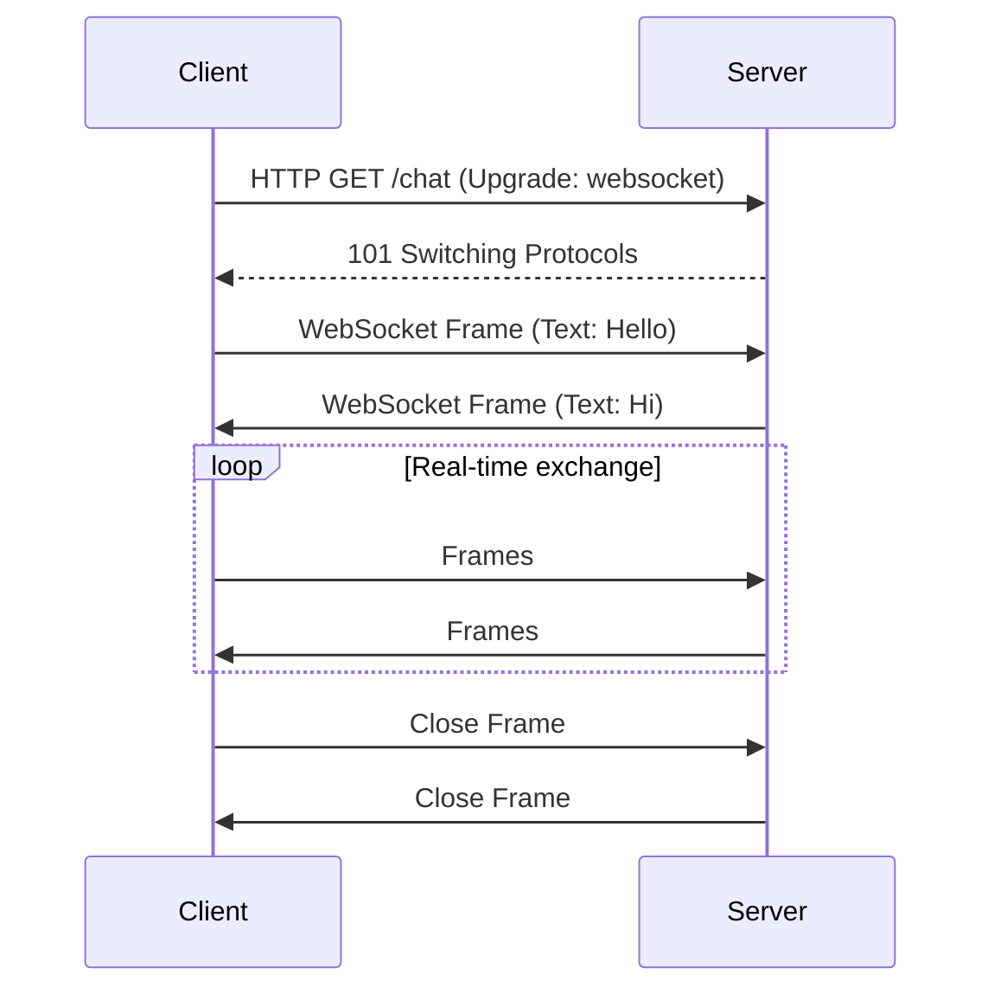

# WebSocket Protocols

## Overview

WebSockets provide a full-duplex communication channel over a single TCP connection, enabling real-time, bidirectional data exchange between clients and servers. Unlike HTTP, WebSockets maintain a persistent connection, making them ideal for applications requiring low-latency updates.

## Detailed Explanation

- **Handshake**: Starts with HTTP upgrade request, switches to WebSocket protocol.
- **Frames**: Data is sent in frames (text, binary, control).
- **Subprotocols**: Extensions like STOMP for messaging.
- **Security**: Uses Origin header for CSRF protection, supports WSS (secure).
- **Benefits**: Reduced overhead, real-time capabilities.
- **Challenges**: Connection management, scalability, firewall issues.

## Journey / Sequence



## Data Models / Message Formats

### WebSocket Frame Structure
- **Opcode**: 0x1 (text), 0x2 (binary), 0x8 (close), etc.
- **Payload**: Data length and content.
- **Masking**: Client masks data for security.

### Example Message
```json
{
  "type": "message",
  "data": "Hello World",
  "timestamp": 1634567890
}
```

## Real-world Examples & Use Cases

- **Chat Applications**: Real-time messaging in Slack or WhatsApp.
- **Live Sports Scores**: Updates without polling.
- **Collaborative Editing**: Google Docs changes.
- **Financial Trading**: Stock price feeds.
- **IoT Dashboards**: Sensor data streaming.

## Code Examples

### Java WebSocket Server (using javax.websocket)

```java
import javax.websocket.*;
import javax.websocket.server.ServerEndpoint;
import java.io.IOException;
import java.util.Set;
import java.util.concurrent.CopyOnWriteArraySet;

@ServerEndpoint("/chat")
public class ChatEndpoint {
    private static Set<Session> sessions = new CopyOnWriteArraySet<>();

    @OnOpen
    public void onOpen(Session session) {
        sessions.add(session);
        broadcast("User joined");
    }

    @OnMessage
    public void onMessage(String message, Session session) {
        broadcast(message);
    }

    @OnClose
    public void onClose(Session session) {
        sessions.remove(session);
        broadcast("User left");
    }

    @OnError
    public void onError(Session session, Throwable throwable) {
        // Handle error
    }

    private void broadcast(String message) {
        for (Session s : sessions) {
            try {
                s.getBasicRemote().sendText(message);
            } catch (IOException e) {
                // Handle
            }
        }
    }
}
```

### Client-side JavaScript

```javascript
const ws = new WebSocket('ws://localhost:8080/chat');

ws.onopen = function(event) {
    console.log('Connected');
    ws.send('Hello Server');
};

ws.onmessage = function(event) {
    console.log('Received: ' + event.data);
};

ws.onclose = function(event) {
    console.log('Disconnected');
};
```

## Common Pitfalls & Edge Cases

- **Connection Drops**: Implement reconnection logic.
- **Message Ordering**: Ensure sequence in high-frequency updates.
- **Scalability**: Use load balancers that support WebSockets.
- **Security**: Validate origins, use WSS.
- **Binary Data**: Handle large payloads efficiently.

## Tools & Libraries

- **Java-WebSocket**: Lightweight library for Java.
- **Socket.IO**: For Node.js, with fallbacks.
- **Spring WebSocket**: Integration with Spring framework.
- **WebSocket King**: Testing tool.

## References

- [RFC 6455 - The WebSocket Protocol](https://tools.ietf.org/html/rfc6455)
- [WebSockets MDN](https://developer.mozilla.org/en-US/docs/Web/API/WebSockets_API)
- [WebSocket Security](https://tools.ietf.org/html/rfc6455#section-10)

## Github-README Links & Related Topics

- [Networking Sockets](../networking/networking-sockets/README.md)
- [Real-time Feeds](../real-time-feeds/README.md)
- [Message Queues and Brokers](../message-queues-and-brokers/README.md)