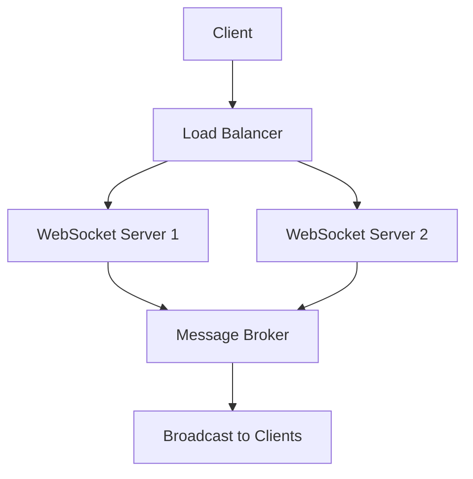

# WebSocket Scaling

## Overview

WebSocket scaling involves managing large numbers of persistent connections for real-time communication. Unlike HTTP, WebSockets maintain long-lived connections, presenting unique challenges for horizontal scaling and resource management.

## Detailed Explanation

WebSockets enable bidirectional, full-duplex communication over a single TCP connection. Key scaling considerations:

- **Connection Management**: Each WebSocket connection consumes server resources (memory, file descriptors).
- **Load Balancing**: Distributing connections across multiple servers.
- **State Management**: Handling user sessions and connection state in distributed systems.
- **Message Broadcasting**: Efficiently sending messages to multiple clients.
- **Connection Limits**: Operating system and hardware constraints on concurrent connections.

Scaling strategies include sticky sessions, message queues, and pub/sub systems.



## Real-world Examples & Use Cases

- **Live Chat Platforms**: Millions of concurrent users in chat rooms.
- **Online Gaming**: Real-time multiplayer game state synchronization.
- **Financial Trading**: Live market data feeds to thousands of traders.
- **Collaborative Editing**: Google Docs-style real-time document collaboration.
- **IoT Dashboards**: Monitoring thousands of connected devices.

## Code Examples

### Basic WebSocket Server (Node.js)

```javascript
const WebSocket = require('ws');
const wss = new WebSocket.Server({ port: 8080 });

wss.on('connection', (ws) => {
  console.log('Client connected');

  ws.on('message', (message) => {
    console.log('Received:', message);
    
    // Echo back to client
    ws.send(`Echo: ${message}`);
  });

  ws.on('close', () => {
    console.log('Client disconnected');
  });
});
```

### Scaled WebSocket with Redis Pub/Sub

```javascript
const WebSocket = require('ws');
const Redis = require('redis');

const wss = new WebSocket.Server({ port: 8080 });
const publisher = Redis.createClient();
const subscriber = Redis.createClient();

subscriber.subscribe('chat_messages');

subscriber.on('message', (channel, message) => {
  // Broadcast to all connected clients
  wss.clients.forEach(client => {
    if (client.readyState === WebSocket.OPEN) {
      client.send(message);
    }
  });
});

wss.on('connection', (ws) => {
  ws.on('message', (message) => {
    // Publish message to Redis
    publisher.publish('chat_messages', message);
  });
});
```

### Load Balancing with Nginx

```nginx
upstream websocket_backend {
    ip_hash;  # Sticky sessions for WebSocket
    server ws-server-1:8080;
    server ws-server-2:8080;
    server ws-server-3:8080;
}

server {
    listen 80;
    location /ws {
        proxy_pass http://websocket_backend;
        proxy_http_version 1.1;
        proxy_set_header Upgrade $http_upgrade;
        proxy_set_header Connection "upgrade";
        proxy_set_header Host $host;
        proxy_set_header X-Real-IP $remote_addr;
        proxy_set_header X-Forwarded-For $proxy_add_x_forwarded_for;
        proxy_set_header X-Forwarded-Proto $scheme;
    }
}
```

## Common Pitfalls & Edge Cases

- **Connection Overhead**: Each connection uses ~2-5KB memory; monitor resource usage.
- **Heartbeat/Ping-Pong**: Implement keep-alive to detect broken connections.
- **Backpressure**: Handle slow clients to prevent message queue buildup.
- **Security**: Validate origins, implement authentication, prevent DoS attacks.
- **Cross-Origin Issues**: Configure CORS properly for WebSocket connections.

## Tools & Libraries

- **Socket.IO**: Abstraction layer with fallback support.
- **µWebSockets**: High-performance WebSocket library.
- **Redis**: Pub/sub for message distribution.
- **Nginx**: Load balancing and proxying.

## References

- [WebSockets API](https://developer.mozilla.org/en-US/docs/Web/API/WebSockets_API)
- [RFC 6455 - The WebSocket Protocol](https://tools.ietf.org/html/rfc6455)
- [Scaling WebSockets](https://ably.com/blog/scaling-websockets)

## Github-README Links & Related Topics

- [WebSocket Protocol](https://tools.ietf.org/html/rfc6455)
- [Load Balancing Strategies](https://nginx.org/en/docs/http/load_balancing.html)