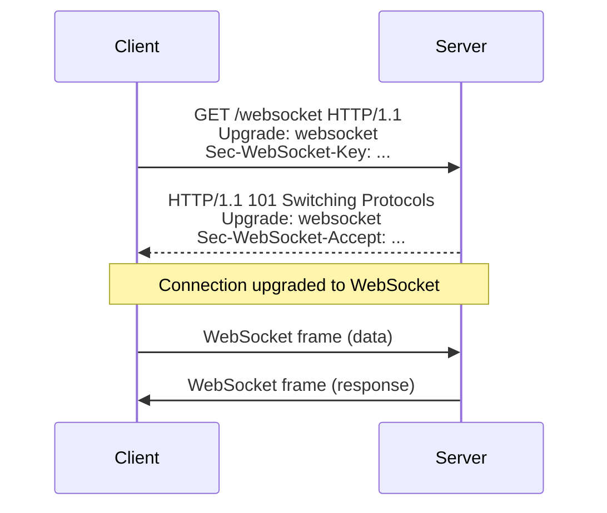

# WebSockets for Real-Time Apps

## Overview

WebSockets provide a full-duplex, bidirectional communication protocol over a single TCP connection, enabling real-time data exchange between clients and servers. Unlike traditional HTTP request-response models, WebSockets maintain a persistent connection, reducing latency and overhead for applications requiring instant updates, such as chat systems, live feeds, and multiplayer games.

## Detailed Explanation

### How WebSockets Work

WebSockets initiate with an HTTP handshake, upgrading the connection to the WebSocket protocol (RFC 6455). The client sends an `Upgrade` header, and upon acceptance, the connection switches to WebSocket frames for data transmission.

Key components:
- **Handshake**: Starts as HTTP/1.1, includes `Sec-WebSocket-Key` for security.
- **Frames**: Data is sent in frames with opcodes (text, binary, ping/pong for keep-alive).
- **Full-Duplex**: Simultaneous send/receive without blocking.

### Advantages

- **Low Latency**: Persistent connection eliminates repeated handshakes.
- **Efficiency**: Minimal overhead compared to HTTP polling.
- **Bidirectional**: Server can push data without client requests.
- **Scalability**: Suitable for high-frequency updates.

### Comparison with Other Real-Time Methods

| Method              | Description                          | Advantages                  | Disadvantages                  |
|---------------------|--------------------------------------|-----------------------------|--------------------------------|
| HTTP Polling       | Client polls server periodically     | Simple implementation       | High latency, inefficient      |
| HTTP Long Polling  | Server holds request until data      | Reduced requests            | Not true real-time, resource intensive |
| Server-Sent Events (SSE) | Server pushes data via HTTP     | Efficient for one-way push  | Unidirectional, limited browser support |
| WebSockets         | Bidirectional full-duplex over TCP   | Low latency, bidirectional  | More complex setup             |

### WebSocket Handshake Sequence



## Real-world Examples & Use Cases

- **Chat Applications**: Platforms like Slack and Discord use WebSockets for instant messaging and presence indicators.
- **Financial Trading**: Stock tickers and trading platforms (e.g., Bloomberg) rely on WebSockets for real-time price updates.
- **Online Gaming**: Multiplayer games (e.g., Fortnite) use WebSockets for player actions and state synchronization.
- **Live Sports Scores**: Apps like ESPN update scores and stats in real-time.
- **Collaborative Editing**: Tools like Google Docs use WebSockets for concurrent edits and cursors.
- **IoT Dashboards**: Monitoring systems for sensors and devices push updates via WebSockets.

## Code Examples

### Node.js Server with `ws` Library

Install: `npm install ws`

```javascript
const WebSocket = require('ws');

const wss = new WebSocket.Server({ port: 8080 });

wss.on('connection', (ws) => {
  console.log('Client connected');

  ws.on('message', (message) => {
    console.log('Received:', message.toString());
    ws.send('Echo: ' + message);
  });

  ws.on('close', () => {
    console.log('Client disconnected');
  });
});

console.log('WebSocket server running on ws://localhost:8080');
```

### Node.js Client

```javascript
const WebSocket = require('ws');

const ws = new WebSocket('ws://localhost:8080');

ws.on('open', () => {
  console.log('Connected to server');
  ws.send('Hello Server!');
});

ws.on('message', (data) => {
  console.log('Received:', data.toString());
});

ws.on('close', () => {
  console.log('Connection closed');
});
```

### Python Server with `websockets` Library

Install: `pip install websockets`

```python
import asyncio
import websockets

async def handler(websocket, path):
    async for message in websocket:
        print(f"Received: {message}")
        await websocket.send(f"Echo: {message}")

start_server = websockets.serve(handler, "localhost", 8080)

asyncio.get_event_loop().run_until_complete(start_server)
asyncio.get_event_loop().run_forever()
```

### Python Client

```python
import asyncio
import websockets

async def connect():
    uri = "ws://localhost:8080"
    async with websockets.connect(uri) as websocket:
        await websocket.send("Hello Server!")
        response = await websocket.recv()
        print(f"Received: {response}")

asyncio.get_event_loop().run_until_complete(connect())
```

## References

- [RFC 6455: The WebSocket Protocol](https://tools.ietf.org/html/rfc6455)
- [MDN Web Docs: WebSockets](https://developer.mozilla.org/en-US/docs/Web/API/WebSockets_API)
- [WebSocket.org: WebSocket Technology](https://websocket.org/)
- [Node.js ws Library](https://github.com/websockets/ws)
- [Python websockets Library](https://websockets.readthedocs.io/)

## Github-README Links & Related Topics

- [Event-Driven Systems](../event-driven-systems/)
- [Real-Time Feeds](../real-time-feeds/)
- [Microservices Communication Patterns](../microservices-communication-patterns/)
- [API Gateway Design](../api-gateway-design/)
- [Networking Sockets](../networking-sockets/)