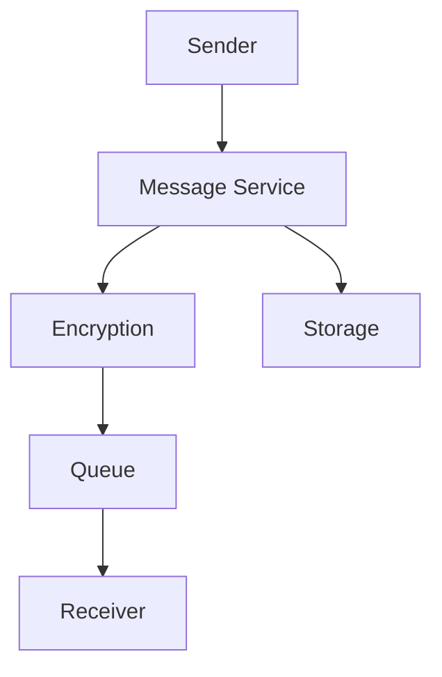

# WhatsApp Messaging System Design

## Overview

WhatsApp handles billions of messages daily with end-to-end encryption, real-time delivery, and high reliability. The system supports text, media, and group chats.

## Detailed Explanation

### Requirements
- **Functional**: Send/receive messages, encryption, offline delivery.
- **Non-Functional**: Real-time, secure, scalable.

### Architecture
- **Message Service**: Handle sending.
- **Storage**: Persistent storage.
- **Push Notifications**: For offline users.



## Real-world Examples & Use Cases
- Group chats with millions of users.
- Media sharing.

## Code Examples

### Send Message
```java
public void sendMessage(Message msg) {
    encrypt(msg);
    queue.send(msg);
    notifyReceiver(msg.receiverId);
}
```

## References
- [WhatsApp Engineering Blog](https://engineering.whatsapp.com/)

## Github-README Links & Related Topics
- [Event Streaming with Apache Kafka](../event-streaming-with-apache-kafka/README.md)
- [Security in Distributed Systems](../security-in-distributed-systems/README.md)