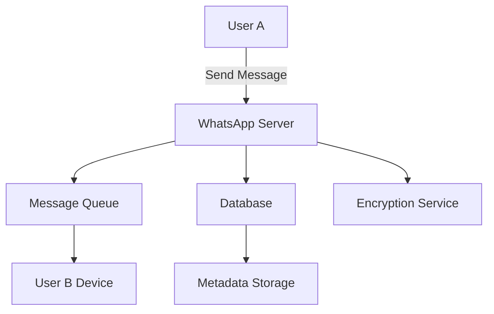

# WhatsApp Messaging System

## Overview
WhatsApp is a real-time messaging platform handling billions of messages daily with end-to-end encryption. This system design covers the architecture for scalable, secure messaging at global scale.

## Detailed Explanation
The system uses a client-server architecture with distributed components:

- **Clients**: Mobile apps maintaining persistent connections
- **Servers**: Handle message routing, encryption, and storage
- **Database**: Stores message metadata and user data
- **Push Notification Service**: Delivers messages when clients are offline

Key components:
- End-to-end encryption using Signal Protocol
- Message queuing for reliability
- Global CDN for media delivery
- Sharding for user data distribution



## Real-world Examples & Use Cases
- **Instant Messaging**: Real-time text, voice, video messages
- **Group Chats**: Multi-user conversations with admin controls
- **Media Sharing**: Photos, videos, documents with compression
- **Business Messaging**: WhatsApp Business API for customer service

## Code Examples
### Message Encryption (Simplified)
```java
public class MessageEncryptor {
    private KeyPair keyPair;

    public EncryptedMessage encrypt(String message, PublicKey recipientKey) {
        // Generate ephemeral key
        KeyPair ephemeral = generateEphemeralKey();
        
        // Derive shared secret
        byte[] sharedSecret = deriveSharedSecret(ephemeral.getPrivate(), recipientKey);
        
        // Encrypt message
        byte[] ciphertext = aesEncrypt(message.getBytes(), sharedSecret);
        
        return new EncryptedMessage(ciphertext, ephemeral.getPublic());
    }
}
```

### Message Routing
```java
public class MessageRouter {
    public void routeMessage(Message msg) {
        // Check recipient online status
        if (isRecipientOnline(msg.getRecipientId())) {
            sendDirect(msg);
        } else {
            queueForLater(msg);
        }
    }
}
```

## References
- [WhatsApp Security Whitepaper](https://www.whatsapp.com/security/)
- [Signal Protocol](https://signal.org/docs/)
- [Building WhatsApp-scale systems](https://engineering.fb.com/2020/05/13/web/whatsapp/)

## Github-README Links & Related Topics
- [Message Queues and Kafka](../system-design/message-queues-and-kafka/README.md)
- [End-to-End Encryption](../system-design/security-authz-authn-tokens/README.md)
- [Distributed Systems](../system-design/consistency-and-availability/README.md)
- [Real-Time Data Processing](../system-design/real-time-data-processing/README.md)