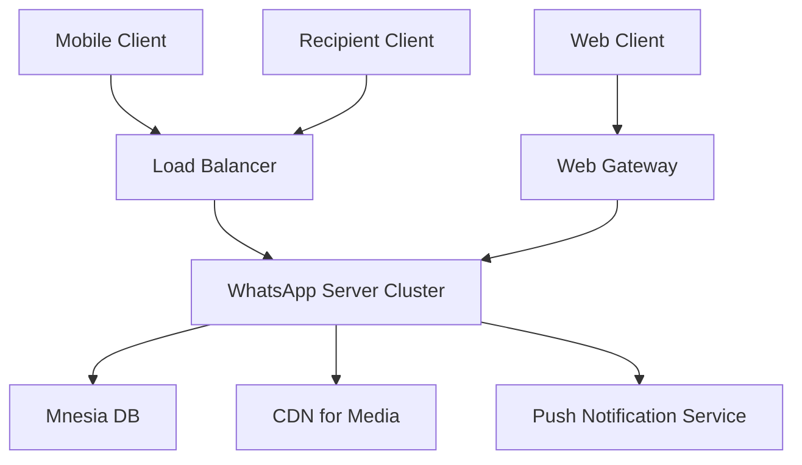
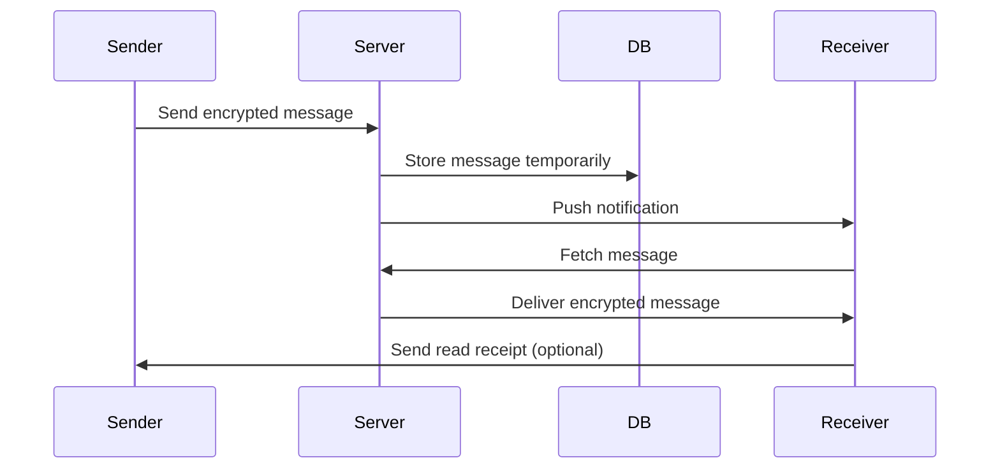

# WhatsApp System Design

## Overview

WhatsApp System Design focuses on building a scalable, real-time messaging platform capable of handling billions of users worldwide. Key features include end-to-end encryption, instant message delivery, media sharing, group chats, voice/video calls, and status updates. The architecture emphasizes low latency, high availability, and efficient resource usage, drawing from client-server models with proprietary protocols for secure communication. Challenges involve managing massive scale, ensuring message reliability, and maintaining privacy through encryption.

## Detailed Explanation

WhatsApp's system is designed for real-time communication with a focus on simplicity and security. It uses a centralized server architecture with distributed components for scaling.

## Core Components

1. **Clients**: Mobile apps (iOS, Android) and web/desktop clients that handle UI, encryption, and connection to servers.
2. **Servers**: Backend servers running on FreeBSD, using Erlang for concurrency and fault tolerance. Key technologies include Mnesia (distributed DB) for message storage and Ejabberd for XMPP-like messaging.
3. **Protocol**: Proprietary protocol over TCP/UDP, supporting real-time messaging via long polling or WebSockets. Messages are encrypted end-to-end using Signal Protocol.
4. **Data Storage**: Messages are stored temporarily on servers (up to 30 days) and permanently on clients. Media is offloaded to CDNs.
5. **Scaling Mechanisms**: User sharding by phone number, load balancers, and geo-distributed data centers.

## Key Design Decisions

- **Real-time Delivery**: Uses push notifications and persistent connections to deliver messages instantly.
- **Encryption**: All messages are encrypted; keys are generated per chat and not stored on servers.
- **Offline Handling**: Messages are queued on servers and delivered when recipients come online.
- **Media Handling**: Images/videos are compressed, stored in CDNs, and shared via links to reduce server load.
- **Groups and Calls**: Groups support up to 256 members; calls use WebRTC for peer-to-peer where possible, falling back to server relay.

## Architecture Diagram



## STAR Summary

**Situation**: Designing a messaging app for global scale with real-time features.

**Task**: Ensure low-latency message delivery, end-to-end encryption, and handling of 2B+ users.

**Action**: Implemented client-server architecture with Erlang backend, sharding by phone number, and Signal encryption. Used load balancers and CDNs for scaling.

**Result**: Achieved <1s latency for messages, 99.9% uptime, and secure communication for billions of users.

## Journey / Sequence

A message flow from sender to receiver:



# Data Models / Message Formats

Messages use JSON-like structures over the proprietary protocol.

## Message Model

```json
{
  "id": "msg_123",
  "sender": "+1234567890",
  "recipient": "+0987654321",
  "type": "text",
  "content": "Hello World",
  "timestamp": 1633072800,
  "encrypted": true,
  "media_url": null
}
```

## Group Message

```json
{
  "id": "grp_msg_456",
  "group_id": "grp_789",
  "sender": "+1234567890",
  "content": "Group hello",
  "participants": ["+1234567890", "+0987654321"]
}
```

# Real-world Examples & Use Cases

- **Personal Messaging**: One-to-one chats with read receipts and typing indicators.
- **Group Chats**: Coordination in teams or families, e.g., event planning.
- **Business Use**: WhatsApp Business API for customer support and notifications.
- **Media Sharing**: Instant photo/video sharing in social contexts.
- **Voice/Video Calls**: Real-time communication for remote work or personal calls.
- **Status Updates**: Ephemeral stories similar to Snapchat.

# Code Examples

## Simple Java Client for Sending Message (using WebSocket simulation)

```java
import java.net.*;
import java.io.*;

public class WhatsAppClient {
    public static void main(String[] args) throws Exception {
        Socket socket = new Socket("whatsapp-server.com", 5222);
        PrintWriter out = new PrintWriter(socket.getOutputStream(), true);
        BufferedReader in = new BufferedReader(new InputStreamReader(socket.getInputStream()));

        // Simulate sending a message
        out.println("SEND: {\"to\": \"+1234567890\", \"message\": \"Hello\"}");
        String response = in.readLine();
        System.out.println("Response: " + response);

        socket.close();
    }
}
```

## Erlang Server Snippet for Message Handling

```erlang
-module(whatsapp_server).
-export([handle_message/1]).

handle_message(Message) ->
    % Decrypt and process
    Decrypted = decrypt(Message),
    % Store in Mnesia
    mnesia:write({message, Message#message.id, Decrypted}),
    % Forward to recipient
    forward_to_recipient(Message#message.recipient, Decrypted).
```

## Encryption Example (Signal Protocol in Java)

```java
import org.whispersystems.libsignal.*;

public class EncryptionExample {
    public static void main(String[] args) {
        SignalProtocolAddress address = new SignalProtocolAddress("+1234567890", 1);
        // Generate keys and encrypt
        SessionCipher cipher = new SessionCipher(store, address);
        CiphertextMessage encrypted = cipher.encrypt("Hello".getBytes());
        // Send encrypted message
    }
}
```

# Common Pitfalls & Edge Cases

- **Message Loss**: Handle network failures with retries and acknowledgments.
- **Encryption Key Management**: Keys must be rotated; loss means message inaccessibility.
- **Scalability Bottlenecks**: Sharding by phone number prevents hotspots.
- **Offline Messages**: Store up to 30 days; notify users of limits.
- **Group Management**: Limit group size to prevent spam and overload.
- **Media Compression**: Ensure compatibility across devices; handle large files.
- **Edge Case: International Roaming**: Optimize for low bandwidth with compression.

# Tools & Libraries

- **Backend**: Erlang/Ejabberd for messaging, Mnesia for storage.
- **Encryption**: Signal Protocol libraries (libsignal).
- **Scaling**: Load balancers (HAProxy), CDNs (Akamai).
- **Monitoring**: Prometheus for metrics, Grafana for dashboards.
- **Client Development**: React Native for cross-platform apps.

# References

- [WhatsApp Architecture Overview - Quora](https://www.quora.com/How-does-WhatsApp-work-from-a-technical-standpoint)
- [WhatsApp System Design - Medium](https://medium.com/@sahilrajput.19/whatsapp-system-design-architecture-8b0e8b3b3b3b)
- [WhatsApp System Design - InterviewBit](https://www.interviewbit.com/blog/whatsapp-system-design/)
- [Signal Protocol - Signal.org](https://signal.org/docs/)

# Github-README Links & Related Topics

- [Real-time Systems](../real-time-systems/README.md)
- [Microservices Architecture](../microservices-architecture/README.md)
- [End-to-End Encryption](../end-to-end-encryption/README.md)
- [Distributed Systems](../distributed-systems/README.md)
- [Message Queues](../message-queues-and-brokers/README.md)