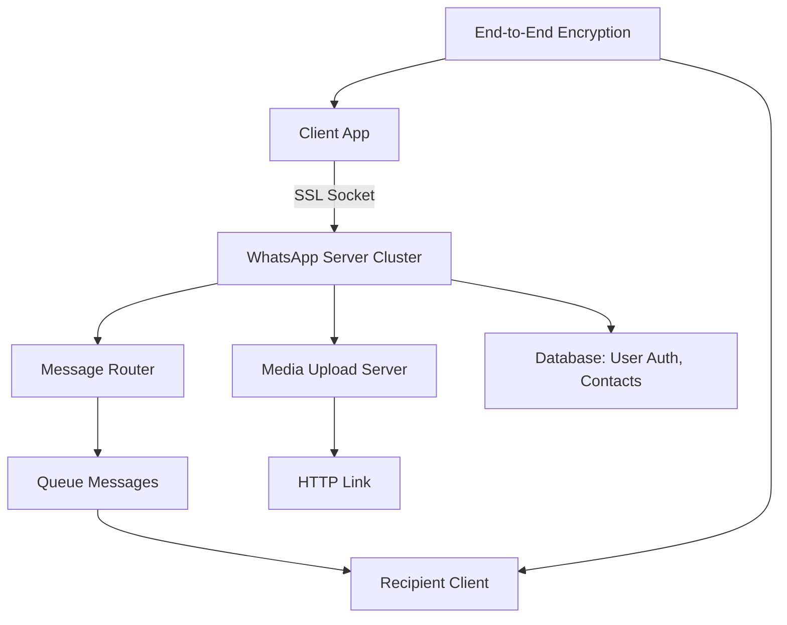

## Overview

WhatsApp is a cross-platform messaging application that enables real-time text, voice, video, and media sharing with end-to-end encryption. Acquired by Facebook in 2014 for $19 billion, it serves over 2 billion users globally, processing billions of messages daily. The system emphasizes simplicity, privacy, and scalability, using Erlang for the backend to handle millions of concurrent connections per server. Key features include offline message queuing, group chats, and no storage of chat history on servers.

## Detailed Explanation

WhatsApp's architecture is designed for high scalability, low latency, and minimal server-side data retention. It consists of client applications, a distributed server infrastructure, and supporting components for message routing, encryption, and storage.

### Key Components

- **Clients**: Mobile apps (iOS, Android, etc.) using SQLite for local storage. Clients maintain persistent connections via SSL sockets and queue messages for offline delivery.
- **Servers**: Erlang-based backend on FreeBSD, handling message routing, user authentication, and media uploads. Servers use custom XMPP-like protocol internally, evolved from ejabberd.
- **Message Routing**: Messages are queued on servers until the recipient connects. Delivery is acknowledged, and messages are deleted post-delivery to minimize storage.
- **Encryption**: End-to-end encryption using the Signal protocol (Curve25519, AES-256, HMAC-SHA256). Keys are generated per session, with no server access to decrypted content.
- **Storage**: Minimal server-side storage; media is uploaded to HTTP servers and linked. User data (phone numbers, contacts) is stored in databases like Mnesia.
- **Scalability**: Supports 2+ million connections per server through Erlang's concurrency model, custom BEAM patches, and optimizations like reduced lock contention and per-scheduler allocators.

### Architecture Diagram



### Performance Stats

| Metric | Value |
|--------|-------|
| Daily Messages | 50+ billion |
| Concurrent Connections per Server | 2+ million |
| Servers | Hundreds of nodes, 8000+ cores |
| RAM | Hundreds of terabytes |
| Erlang Messages/sec | 70+ million |

## Real-world Examples & Use Cases

- **Personal Messaging**: Users send texts, photos, and videos globally without SMS costs. Example: A user in the US messages family in Europe; messages queue if offline.
- **Group Chats**: Supports up to 256 members for events like family reunions or project teams.
- **Media Sharing**: Voice notes, videos, and documents are uploaded and linked, used in business for quick file sharing (e.g., Singapore entrepreneurs using WhatsApp for deals).
- **Event-Driven Spikes**: Handles traffic surges during soccer matches (35% outbound spike) or earthquakes without downtime.
- **Business Applications**: Police in Spain use it for coordination; taxi hailing in China via integrations.

## Code Examples

### Pseudocode for Message Sending

```python
def send_message(sender_id, recipient_id, content):
    # Encrypt message with recipient's public key
    encrypted_content = encrypt(content, get_public_key(recipient_id))
    
    # Queue on server
    server_queue.add({
        'sender': sender_id,
        'recipient': recipient_id,
        'content': encrypted_content,
        'timestamp': now()
    })
    
    # Notify sender of send status
    notify_sender(sender_id, 'sent')
```

### Erlang Snippet for Connection Handling

```erlang
% Simplified process for handling a client connection
handle_connection(Socket) ->
    receive
        {tcp, Socket, Data} ->
            % Parse and route message
            Message = parse_message(Data),
            route_message(Message),
            handle_connection(Socket);
        {tcp_closed, Socket} ->
            % Clean up
            ok
    end.
```

### Encryption Key Exchange (Simplified)

```javascript
// Client-side key generation
const keyPair = generateKeyPair(); // Curve25519
const sharedSecret = deriveSharedSecret(recipientPublicKey, keyPair.privateKey);
const encryptionKey = hkdf(sharedSecret, 'WhatsApp'); // HKDF for AES key
```

## STAR Summary

- **Situation**: Rapid user growth to 450 million active users, processing 50 billion messages daily, requiring extreme scalability.
- **Task**: Optimize server infrastructure to handle 2+ million connections per server while maintaining low latency and privacy.
- **Action**: Adopted Erlang, patched BEAM for reduced contention, added instrumentation (e.g., message queue monitoring), and tuned FreeBSD networking.
- **Result**: Achieved 2.8 million connections per server, linear SMP scalability, and reliable service during global events.

## Journey / Sequence

1. **Registration**: User provides phone number; server sends SMS PIN for verification and generates permanent key.
2. **Connection**: Client establishes SSL socket; server authenticates via key.
3. **Message Send**: Client encrypts message, sends to server; server queues until recipient connects.
4. **Delivery**: Recipient fetches queued messages; server deletes post-acknowledgment.
5. **Media**: Uploaded to HTTP server; link sent in message with thumbnail.

## Data Models / Message Formats

- **Message Format** (JSON-like):
  ```json
  {
    "id": "msg123",
    "sender": "phone123",
    "recipient": "phone456",
    "type": "text|media",
    "content": "encrypted_payload",
    "timestamp": 1634567890,
    "status": "sent|delivered|read"
  }
  ```
- **User Model**: Phone number as ID; no usernames; contacts synced from phone book.

## Common Pitfalls & Edge Cases

- **Scalability Bottlenecks**: Lock contention in BEAM; mitigated by per-scheduler allocators and reduced port interactions.
- **Offline Delivery**: Messages queue indefinitely; edge case: device change invalidates key, requiring re-registration.
- **Encryption Flaws**: Early versions lacked end-to-end; now uses Signal protocol, but key management is critical.
- **Network Glitches**: Burst loads cause backlogs; monitored via message queue lengths.
- **Privacy Risks**: Metadata (e.g., who messaged whom) is visible to servers; no content access.

## Tools & Libraries

- **Backend**: Erlang/OTP, FreeBSD, ejabberd (modified), Mnesia (database).
- **Encryption**: Libsignal (Signal protocol library).
- **Monitoring**: Custom tools like wsar for stats, pmcstat for CPU counters, dtrace for debugging.
- **Deployment**: Softlayer hosting, custom BEAM patches for performance.

## References

- [The WhatsApp Architecture Facebook Bought For $19 Billion](https://highscalability.com/blog/2014/2/26/the-whatsapp-architecture-facebook-bought-for-19-billion.html) - High Scalability blog detailing backend, scalability optimizations, and stats.
- [WhatsApp Engineering](https://engineering.fb.com/2014/02/19/core-data/whatsapp-engineering/) - Facebook Engineering blog on acquisition and technical insights.
- [WhatsApp Security Whitepaper](https://www.whatsapp.com/security/) - Official security overview, including encryption details.
- [Wikipedia: WhatsApp](https://en.wikipedia.org/wiki/WhatsApp) - General overview and history.
- [Erlang Factory Talk: Scaling to Millions of Simultaneous Connections](http://vimeo.com/44312354) - Rick Reed's presentation on optimizations.

## Github-README Links & Related Topics

- [Event-Driven Architecture](../event-driven-architecture/README.md)
- [Distributed Systems](../distributed-systems/README.md)
- [Real-Time Messaging](../real-time-messaging/README.md)
- [End-to-End Encryption](../end-to-end-encryption/README.md)
- [Scalability Patterns](../scalability-patterns/README.md)