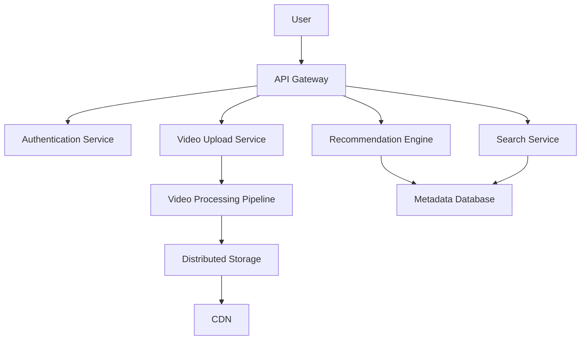

# YouTube System Design

## Overview

YouTube is a global video-sharing platform that handles billions of videos, trillions of views, and massive user interactions daily. This document outlines the high-level system design for YouTube, focusing on scalability, reliability, and performance to support millions of concurrent users.

## Detailed Explanation

### High-Level Architecture



### Key Components

- **API Gateway**: Routes requests, handles load balancing, and provides security.
- **Video Processing Service**: Transcodes videos into multiple formats (e.g., MP4, WebM) and resolutions (e.g., 720p, 1080p, 4K).
- **Storage Layer**: Uses distributed file systems and object storage (e.g., Google Cloud Storage) for video files, with CDN integration for global distribution.
- **Database**: NoSQL databases like Bigtable for metadata, user data, comments, and analytics.
- **Recommendation Engine**: Machine learning models to suggest videos based on user behavior.
- **Search and Discovery**: Inverted indexes and real-time indexing for video search.

### Data Models

- **Video Metadata**: ID, title, description, uploader, upload time, duration, views, likes, etc.
- **User Data**: Profile, subscriptions, watch history.
- **Comments**: Hierarchical structure for replies.

### Scalability Strategies

- **Sharding**: Database sharding by user ID or video ID.
- **Caching**: Redis for hot metadata and recommendations.
- **Asynchronous Processing**: Queue-based video processing to handle uploads without blocking.
- **Global Distribution**: Multi-region deployments with geo-replication.

## Real-world Examples & Use Cases

- **Viral Content**: Handling exponential traffic growth for trending videos using auto-scaling.
- **Live Streaming**: Real-time broadcasting with low latency for events like concerts or sports.
- **Personalized Feeds**: AI-driven recommendations to keep users engaged.
- **Mobile Optimization**: Adaptive bitrate streaming for varying network conditions.

## Code Examples

### Java Pseudo-code for Video Upload

```java
@Service
public class VideoUploadService {

    @Autowired
    private StorageService storageService;

    @Autowired
    private QueueService queueService;

    @Autowired
    private DatabaseService dbService;

    public String uploadVideo(User user, MultipartFile videoFile, VideoMetadata metadata) {
        // Authenticate user
        if (!authService.validateToken(user.getToken())) {
            throw new SecurityException("Invalid user");
        }

        // Generate unique video ID
        String videoId = UUID.randomUUID().toString();

        // Store video temporarily
        String tempPath = storageService.storeTemp(videoFile, videoId);

        // Save initial metadata
        metadata.setId(videoId);
        metadata.setStatus("PROCESSING");
        dbService.save(metadata);

        // Queue for transcoding
        queueService.sendMessage("video-processing-queue", new ProcessingTask(videoId, tempPath));

        return videoId;
    }
}
```

### Python Pseudo-code for Recommendation

```python
def get_recommendations(user_id, watch_history):
    # Fetch user embeddings
    user_embedding = embedding_service.get_user_embedding(user_id)
    
    # Query similar videos
    candidates = vector_db.query_similar(user_embedding, top_k=100)
    
    # Rank by engagement
    ranked = ranker.rank(candidates, watch_history)
    
    return ranked[:20]
```

## Common Pitfalls & Edge Cases

- **Copyright Detection**: Automated systems to flag and remove infringing content.
- **Abuse Prevention**: Rate limiting uploads and comments to prevent spam.
- **Cold Start Problem**: Handling new users with no watch history for recommendations.
- **Video Quality**: Ensuring transcoding doesn't degrade quality or introduce artifacts.

## Tools & Libraries

- **Storage**: Google Cloud Storage, AWS S3
- **CDN**: Cloudflare, Akamai
- **Databases**: Bigtable, Cassandra
- **Processing**: FFmpeg for transcoding
- **ML**: TensorFlow for recommendations

## References

- [YouTube's Architecture: A Deep Dive](https://blog.youtube/engineering/architecture/)
- [Scaling YouTube to Billions of Users](https://www.youtube.com/watch?v=2XKCG1l6LxI)
- [Video Processing at Scale](https://netflixtechblog.com/video-processing-at-scale/)

## Github-README Links & Related Topics

- [System Design Basics](system-design-basics/README.md)
- [High Scalability Patterns](high-scalability-patterns/README.md)
- [Netflix Video Streaming Architecture](netflix-video-streaming-architecture/README.md)
- [Distributed Tracing and Observability](system-design/distributed-tracing-and-observability/README.md)