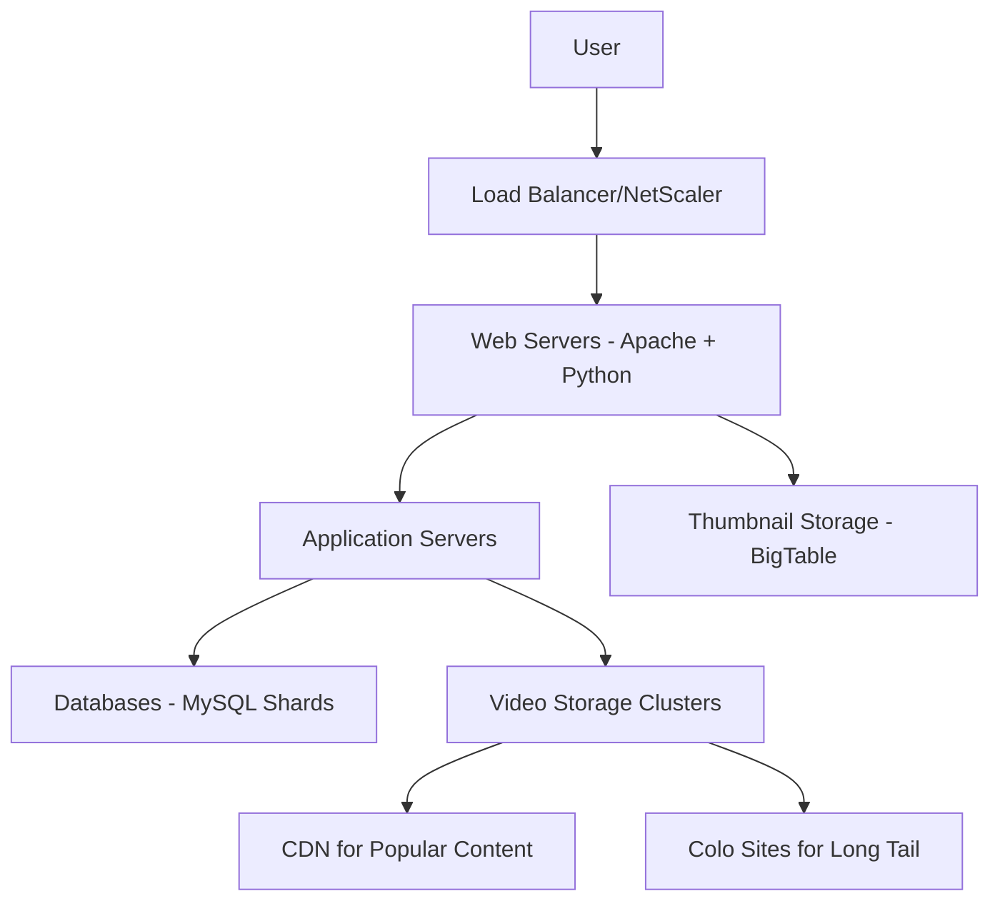
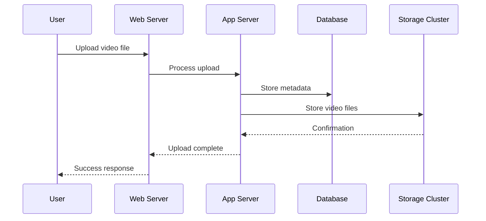
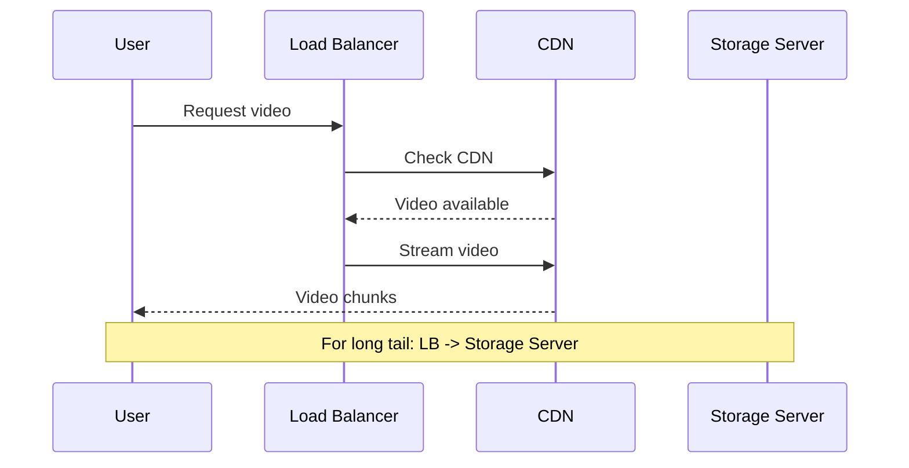

# YouTube System Design

## Overview

YouTube is a global video-sharing platform that handles billions of video views daily, requiring robust scalability, low-latency delivery, and efficient storage. This document outlines the system design principles, architecture, and lessons learned from YouTube's evolution, focusing on handling massive scale while maintaining performance.

Key challenges include:
- Delivering over 1 billion daily views (as of 2009 updates)
- Managing petabytes of video data
- Ensuring global low-latency access
- Handling the "long tail" of content popularity

## Detailed Explanation

### Architecture Components

YouTube's architecture evolved from a simple setup to a distributed, sharded system. Here's a high-level overview:



#### Web Tier
- **Load Balancing**: NetScaler for static content caching and request distribution
- **Web Servers**: Apache with mod_fastcgi, running Python applications
- **Application Logic**: Python for rapid development, with psyco JIT compiler for performance
- **Caching**: Row-level DB caching, pre-calculated values sent to all servers

#### Video Serving
- **Mini-Clusters**: Each video hosted on multiple machines for redundancy
- **Web Server**: lighttpd with epoll for high concurrency
- **CDN Integration**: Popular content served via CDN for global distribution
- **Long Tail Handling**: Less popular videos served from colo sites with optimized I/O

#### Database Layer
- **Evolution**: Single server → Master-slave → Partitioning → Sharding
- **Sharding Strategy**: User-based sharding for better cache locality
- **Benefits**: 30% hardware reduction, zero replica lag

### Scalability Strategies

| Strategy | Description | Impact |
|----------|-------------|--------|
| Sharding | User-based data partitioning | Improved write performance, reduced lag |
| CDN | Content delivery networks | Reduced latency, lower bandwidth costs |
| Caching | Multi-level caching (DB, app, CDN) | Faster response times |
| Commodity Hardware | Standard servers vs. expensive hardware | Cost-effective scaling |

## Real-world Examples & Use Cases

### Video Upload Flow
1. User uploads video via web interface
2. Video processed for multiple formats/resolutions
3. Metadata stored in sharded database
4. Video files distributed to mini-clusters
5. Thumbnails generated and stored in BigTable

### Video Playback
1. User requests video
2. Load balancer routes to nearest server/CDN
3. Video stream delivered with adaptive bitrate
4. Analytics data collected for recommendations

### Search and Discovery
- Inverted index for video metadata
- Recommendation engine using view patterns
- Trending algorithms based on real-time metrics

## Code Examples

### Python Video Upload Handler (Simplified)

```python
import os
from flask import Flask, request, jsonify

app = Flask(__name__)

@app.route('/upload', methods=['POST'])
def upload_video():
    file = request.files['video']
    user_id = request.form['user_id']
    
    # Determine shard based on user_id
    shard_id = get_shard_for_user(user_id)
    
    # Save video to distributed storage
    video_path = save_to_cluster(file, shard_id)
    
    # Store metadata
    metadata = {
        'title': request.form['title'],
        'user_id': user_id,
        'path': video_path,
        'duration': get_video_duration(file)
    }
    store_metadata(metadata, shard_id)
    
    return jsonify({'video_id': generate_video_id()})

def get_shard_for_user(user_id):
    # Simple hash-based sharding
    return hash(user_id) % NUM_SHARDS
```

### Database Schema (MySQL)

```sql
CREATE TABLE videos (
    video_id BIGINT PRIMARY KEY,
    user_id BIGINT,
    title VARCHAR(255),
    description TEXT,
    upload_time TIMESTAMP,
    duration INT,
    view_count BIGINT DEFAULT 0,
    thumbnail_path VARCHAR(500),
    video_path VARCHAR(500)
) ENGINE=InnoDB;

CREATE TABLE users (
    user_id BIGINT PRIMARY KEY,
    username VARCHAR(255),
    email VARCHAR(255),
    created_at TIMESTAMP
) ENGINE=InnoDB;
```

### Load Balancer Configuration (Nginx Example)

```nginx
upstream app_servers {
    server app1.youtube.com:80;
    server app2.youtube.com:80;
    server app3.youtube.com:80;
}

server {
    listen 80;
    location / {
        proxy_pass http://app_servers;
        proxy_set_header Host $host;
        proxy_set_header X-Real-IP $remote_addr;
    }
    
    location /static/ {
        proxy_pass http://cdn.youtube.com;
    }
}
```

## STAR Summary

**Situation**: YouTube experienced explosive growth, reaching 100 million video views per day by July 2006 with limited staff.

**Task**: Scale the platform to handle massive video delivery while maintaining performance and keeping costs low.

**Action**: 
- Implemented database sharding to reduce replica lag
- Adopted CDN for popular content
- Used commodity hardware and open-source tools
- Continuously iterated on bottlenecks across software, OS, and hardware layers

**Result**: Achieved 30% hardware reduction, zero replica lag, and ability to scale arbitrarily while serving billions of daily views.

## Journey / Sequence

### User Upload Journey


### Video Playback Journey


## Data Models / Message Formats

### Video Metadata Model
```json
{
  "video_id": "dQw4w9WgXcQ",
  "user_id": 12345,
  "title": "Rick Astley - Never Gonna Give You Up",
  "description": "Official music video",
  "tags": ["music", "80s", "classic"],
  "duration": 213,
  "upload_date": "2009-10-25T00:00:00Z",
  "view_count": 1000000000,
  "like_count": 50000000,
  "thumbnail_urls": {
    "default": "https://img.youtube.com/vi/dQw4w9WgXcQ/default.jpg",
    "medium": "https://img.youtube.com/vi/dQw4w9WgXcQ/mqdefault.jpg",
    "high": "https://img.youtube.com/vi/dQw4w9WgXcQ/hqdefault.jpg"
  },
  "video_urls": {
    "360p": "https://r1---sn-abc123.googlevideo.com/videoplayback?...",
    "720p": "https://r2---sn-def456.googlevideo.com/videoplayback?..."
  }
}
```

### User Session Message
```json
{
  "session_id": "abc123def456",
  "user_id": 12345,
  "ip_address": "192.168.1.1",
  "user_agent": "Mozilla/5.0...",
  "actions": [
    {
      "timestamp": "2023-09-26T10:00:00Z",
      "action": "view",
      "video_id": "dQw4w9WgXcQ",
      "watch_time": 45
    }
  ]
}
```

## Common Pitfalls & Edge Cases

### Long Tail Content
- **Pitfall**: Optimizing for popular content neglects the majority of videos with low views
- **Solution**: Use colo sites with optimized I/O for random access patterns
- **Edge Case**: Viral videos transitioning from long tail to popular require migration to CDN

### Thumbnail Serving
- **Pitfall**: High number of small files causing disk seek issues and inode cache problems
- **Solution**: Use distributed storage like BigTable to clump files and provide multi-level caching
- **Edge Case**: Page loads with 60+ thumbnails requiring sub-100ms response times

### Database Scaling
- **Pitfall**: Replica lag in master-slave setups causing inconsistent reads
- **Solution**: Implement sharding with user-based partitioning
- **Edge Case**: Cross-shard queries requiring careful schema design

### Bandwidth Costs
- **Pitfall**: Exponential bandwidth growth with video quality improvements
- **Solution**: Adaptive bitrate streaming and CDN partnerships
- **Edge Case**: Live streaming events with unpredictable viewership spikes

## Tools & Libraries

| Component | Tools Used | Purpose |
|-----------|------------|---------|
| Web Servers | Apache, lighttpd | HTTP serving, static content |
| Application | Python, psyco | Rapid development, JIT compilation |
| Database | MySQL | Metadata storage, sharding |
| Storage | BigTable | Thumbnail storage, distributed data |
| Load Balancing | NetScaler | Request distribution, caching |
| CDN | Multiple providers | Global content delivery |
| Monitoring | Custom scripts | Bottleneck identification |

## References

- [YouTube Architecture - High Scalability](https://highscalability.com/youtube-architecture)
- [7 Years Of YouTube Scalability Lessons In 30 Minutes](https://highscalability.com/7-years-of-youtube-scalability-lessons-in-30-minutes/)
- [YouTube Reaches One Billion Views Per Day](https://mashable.com/2009/10/09/youtube-billion-views/)
- [Google Video Presentation on YouTube Architecture](https://www.youtube.com/watch?v=w5WVu624fY8)

## Github-README Links & Related Topics

- [CDN Architecture](../cdn-architecture/README.md) - Content delivery networks for global distribution
- [Distributed Caching with Redis](../distributed-caching-with-redis/README.md) - Caching strategies for performance
- [Database Sharding Strategies](../database-sharding-strategies/README.md) - Horizontal scaling techniques
- [CAP Theorem and Distributed Systems](../cap-theorem-and-distributed-systems/README.md) - Consistency trade-offs
- [Event-Driven Architecture](../event-driven-architecture/README.md) - Asynchronous processing patterns
- [Fault Tolerance in Distributed Systems](../fault-tolerance-in-distributed-systems/README.md) - Building resilient systems