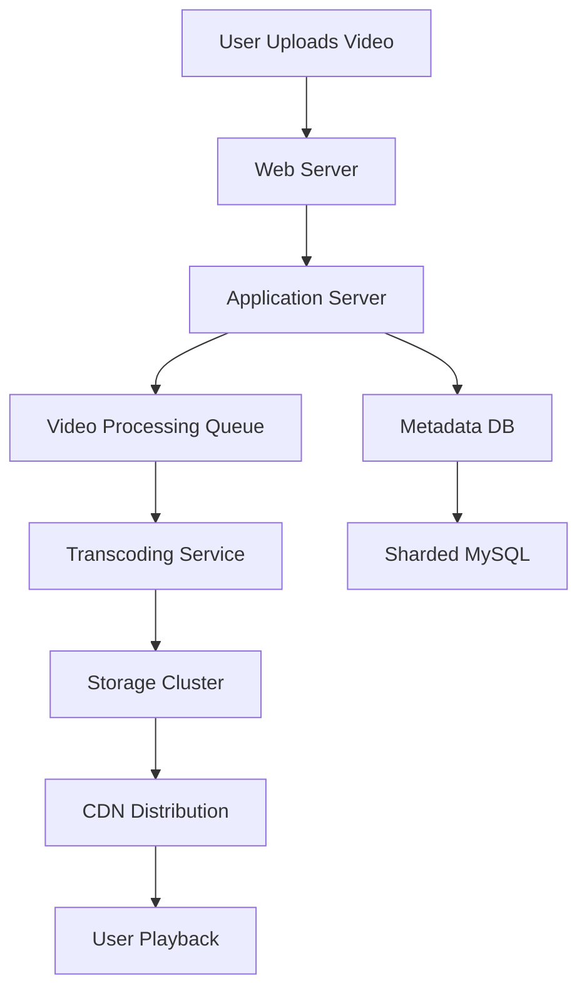

# YouTube System Design

## Overview

YouTube is a global video-sharing platform that handles billions of video views daily, requiring robust system design for scalability, reliability, and low-latency delivery. This document outlines the architectural principles, components, and engineering decisions behind building a YouTube-like system, focusing on video upload, processing, storage, and streaming at massive scale.

Key challenges include handling high-volume uploads, transcoding videos into multiple formats, distributing content via CDNs, and ensuring fault tolerance. The system leverages microservices, distributed databases, and edge computing to achieve sub-second latencies for video playback.

## Detailed Explanation

### Architecture Overview

YouTube's architecture evolved from a monolithic setup to a distributed, sharded system. Core components include:

- **Web Servers**: Handle user requests, load-balanced with NetScaler or similar.
- **Application Servers**: Python-based for rapid development, using FastCGI.
- **Video Processing**: Transcode videos into formats like MP4, WebM.
- **Storage**: Distributed file systems and databases for metadata.
- **CDN**: For global content delivery.
- **Databases**: Sharded MySQL for metadata, BigTable for thumbnails.



### Core Components

| Component | Description | Technologies |
|-----------|-------------|--------------|
| Video Upload | Handles file uploads, validates formats | Apache, Python, FastCGI |
| Transcoding | Converts videos to multiple resolutions/bitrate | FFmpeg, distributed workers |
| Storage | Stores original and transcoded videos | Distributed file systems (e.g., GFS-like) |
| Metadata DB | Stores user, video info, comments | Sharded MySQL, BigTable |
| CDN | Delivers content globally | Akamai, Cloudflare equivalents |
| Recommendations | ML-based suggestions | TensorFlow, distributed computing |

### Scalability Strategies

- **Sharding**: Databases sharded by user ID for even load distribution.
- **Caching**: Row-level DB caching, in-memory caches for popular content.
- **Replication**: Read replicas for metadata, multi-site replication for videos.
- **CDN Integration**: Popular videos served from edge locations to reduce latency.

## STAR Summary

- **Situation**: Rapid user growth led to 100M+ daily views with limited infrastructure.
- **Task**: Scale video delivery while maintaining <100ms page loads and reliable streaming.
- **Action**: Implemented sharding, CDNs, and optimized serving with lighttpd; prioritized video watch traffic.
- **Result**: Reduced hardware by 30%, eliminated replica lag, supported billions of views.

## Journey / Sequence

### Video Upload Flow
1. User uploads video via web interface.
2. File validated and stored temporarily.
3. Metadata extracted (duration, thumbnails).
4. Video queued for transcoding.
5. Transcoded versions stored in distributed storage.
6. Metadata updated in DB; video published.

### Playback Flow
1. User requests video.
2. Metadata fetched from DB.
3. Video URL resolved via CDN.
4. Stream delivered in adaptive bitrate (e.g., HLS/DASH).

## Data Models / Message Formats

### Video Metadata (JSON Example)
```json
{
  "videoId": "abc123",
  "title": "Sample Video",
  "uploaderId": "user456",
  "duration": 300,
  "formats": ["720p", "1080p"],
  "thumbnails": ["thumb1.jpg", "thumb2.jpg"],
  "uploadTime": "2023-09-25T10:00:00Z",
  "views": 1000000
}
```

### User Data Model
- **Fields**: userId (PK), username, email, subscriptions (array of channelIds).
- **Storage**: Sharded MySQL table.

## Real-world Examples & Use Cases

- **High-Traffic Events**: During viral videos, CDNs handle 99% of traffic, reducing origin server load.
- **Global Reach**: Videos served from nearest edge, e.g., a user in India gets content from an Asian CDN node.
- **Live Streaming**: Extends to real-time broadcasts using WebRTC and adaptive streaming.
- **Mobile Optimization**: Lower bitrate formats for bandwidth-constrained users.

## Code Examples

### Java: Simple Video Upload Handler (Spring Boot)
```java
@RestController
public class VideoController {
    @Autowired
    private VideoService videoService;

    @PostMapping("/upload")
    public ResponseEntity<String> uploadVideo(@RequestParam("file") MultipartFile file) {
        try {
            String videoId = videoService.processUpload(file);
            return ResponseEntity.ok("Video uploaded: " + videoId);
        } catch (Exception e) {
            return ResponseEntity.status(500).body("Upload failed");
        }
    }
}
```

### Java: Video Transcoding with FFmpeg (via ProcessBuilder)
```java
public void transcodeVideo(String inputPath, String outputPath) throws IOException {
    ProcessBuilder pb = new ProcessBuilder(
        "ffmpeg", "-i", inputPath, "-vf", "scale=1280:720", outputPath
    );
    pb.start().waitFor();
}
```

## Common Pitfalls & Edge Cases

- **Long Tail Content**: Low-view videos cause random disk seeks; mitigate with RAID tuning.
- **Thumbnail Serving**: High I/O for small files; use distributed stores like BigTable.
- **Replica Lag**: Asynchronous replication delays; shard to reduce.
- **CDN Costs**: Bandwidth-heavy; optimize with caching and compression.
- **Edge Case**: Corrupted uploads; validate early with checksums.

## Tools & Libraries

- **Video Processing**: FFmpeg, OpenCV.
- **Storage**: Apache Hadoop HDFS, Google BigTable.
- **Databases**: MySQL (sharded), Cassandra.
- **CDN**: Cloudflare, Akamai.
- **Monitoring**: Prometheus, Grafana.
- **Java Frameworks**: Spring Boot for microservices.

## References

- [YouTube Architecture - High Scalability](https://highscalability.com/youtube-architecture)
- [YouTube Scalability Lessons](https://highscalability.com/7-years-of-youtube-scalability-lessons-in-30-minutes/)
- [System Design Primer: YouTube](https://github.com/donnemartin/system-design-primer/blob/master/solutions/system_design/youtube/README.md)
- [Google Video Presentation](https://www.youtube.com/watch?v=w5WVu624fY8)

## Github-README Links & Related Topics

- [CDN Architecture](../cdn-architecture/README.md)
- [Microservices Architecture](../microservices-architecture/README.md)
- [Database Sharding Strategies](../database-sharding-strategies/README.md)
- [Load Balancing and Strategies](../load-balancing-and-strategies/README.md)
- [Video Streaming: Netflix](../netflix-video-streaming/README.md)
- [Distributed Tracing](../distributed-tracing/README.md)