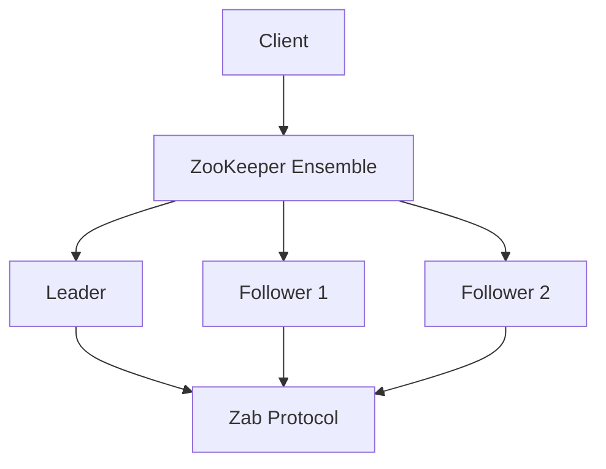

# Zookeeper for Coordination

## Overview

Apache ZooKeeper is a distributed coordination service that provides primitives for building distributed applications. It offers a simple interface for name service, configuration management, distributed synchronization, and group services.

## Detailed Explanation

ZooKeeper maintains a hierarchical namespace of znodes, similar to a file system. It provides guarantees about ordering, atomicity, and durability.

### Key Features

- **Znodes**: Data nodes in the hierarchy
- **Watches**: Notification mechanism for changes
- **Ephemeral nodes**: Exist only while session is active
- **Sequential nodes**: Auto-incrementing names

### Common Recipes

- Leader election
- Distributed locks
- Configuration management
- Group membership



## Real-world Examples & Use Cases

- Apache Kafka: Topic management and broker coordination
- Apache Hadoop: Namenode coordination
- Distributed databases: Configuration and leader election

## Code Examples

### Java ZooKeeper Client

```java
import org.apache.zookeeper.*;

public class ZKClient implements Watcher {
    private ZooKeeper zk;
    
    public ZKClient(String connectString) throws Exception {
        zk = new ZooKeeper(connectString, 3000, this);
    }
    
    public void createNode(String path, byte[] data) throws Exception {
        zk.create(path, data, ZooDefs.Ids.OPEN_ACL_UNSAFE, CreateMode.PERSISTENT);
    }
    
    public byte[] getData(String path) throws Exception {
        return zk.getData(path, true, null);
    }
    
    @Override
    public void process(WatchedEvent event) {
        System.out.println("Event: " + event.getType() + " " + event.getPath());
    }
}
```

### Leader Election Recipe

```java
public class LeaderElection implements Watcher {
    // Implementation of leader election using ephemeral sequential nodes
    // When the lowest numbered node, become leader
}
```

## Tools & Libraries

- Apache Curator: High-level ZooKeeper client
- Kazoo: Python client
- ZkClient: Scala client

## References

- [ZooKeeper Documentation](https://zookeeper.apache.org/doc/current/)
- [ZooKeeper Recipes](https://zookeeper.apache.org/doc/current/recipes.html)
- [Apache Curator](https://curator.apache.org/)

## Github-README Links & Related Topics

- [consensus-algorithms](../consensus-algorithms/README.md)
- [paxos-algorithm](../paxos-algorithm/README.md)
- [distributed-tracing](../distributed-tracing/README.md)